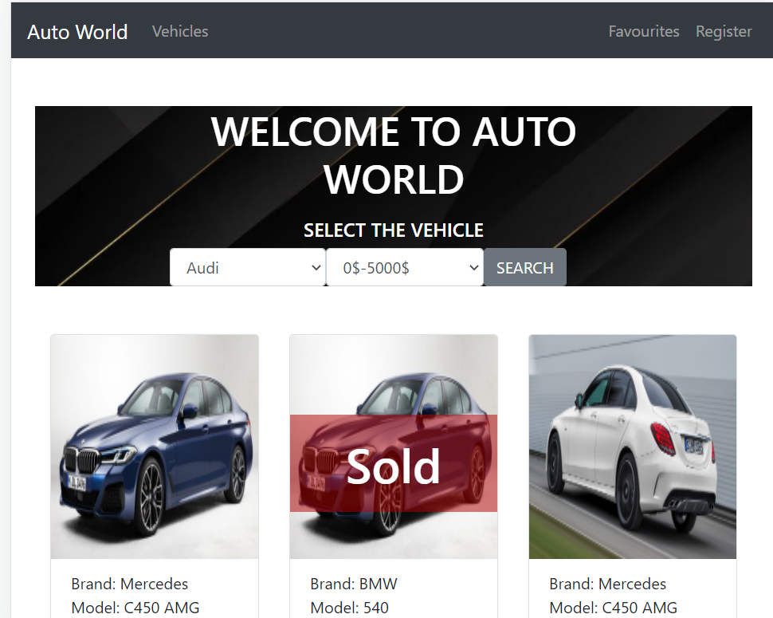

## Buy & Sell App - Lighthouse Labs Midterm Project

Auto World is a buy-and-sell app built with Node.js, Express and PostgreSQL where buyer/ seller can sign-up and communicate through the web. The seller can create posts,delete the posts and can mark items as sold he created. The buyer can favorite the cars they are interested in, look at them in Favourites page later and search the cars by price and brand. The buyer can communicate with seller by sending a email and message.

## Final Product

## Getting Started

1. Install dependencies: `npm i`
2. Fix to binaries for sass: `npm rebuild node-sass`
3. Reset database: `npm run db:reset`
4. Run the server: `npm run local`
5. Set .env file
6. Install required packages [nodemailer, express-fileupload, twilio]
7. Visit `http://localhost:8080/`

## Dependencies

* Node.js
* Express
* EJS
* pg
* pg-native
* chalk
* body-parser
* cookie-session
* dotenv
* morgan
* node-sass-middleware
* Nodemailer
* twilio
* express-fileupload

